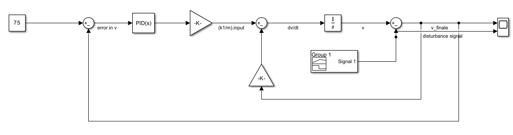
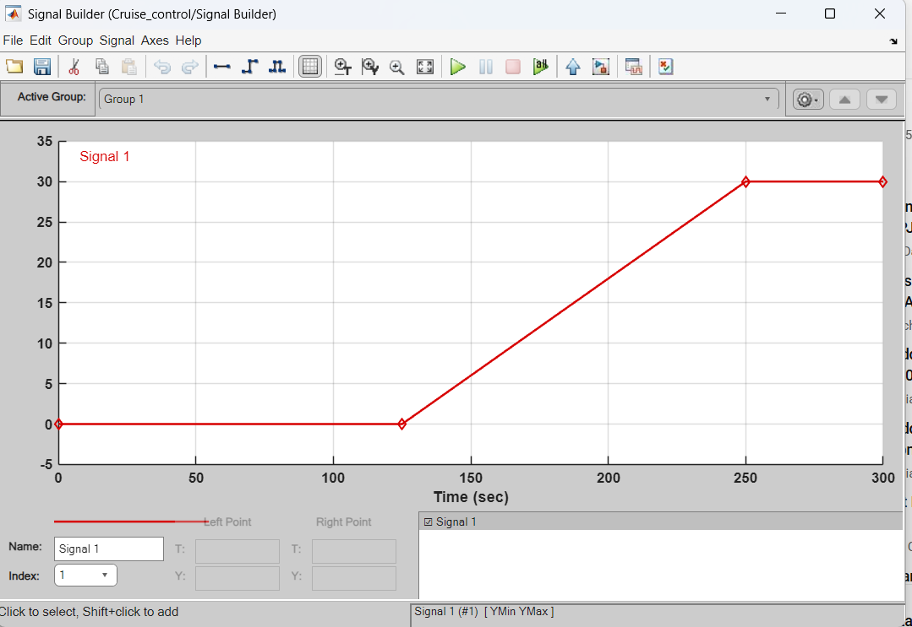
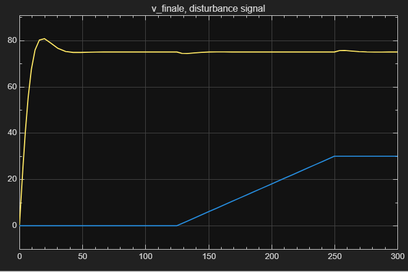
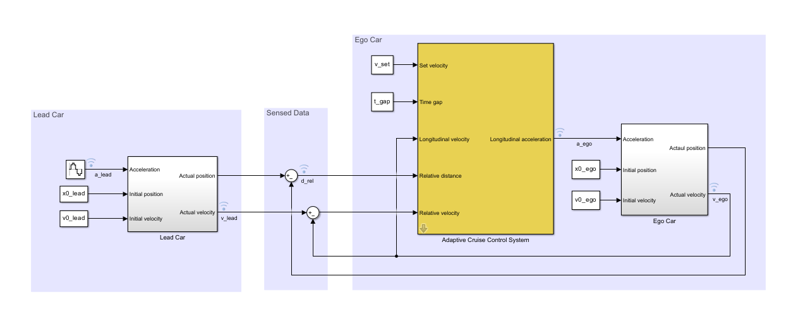
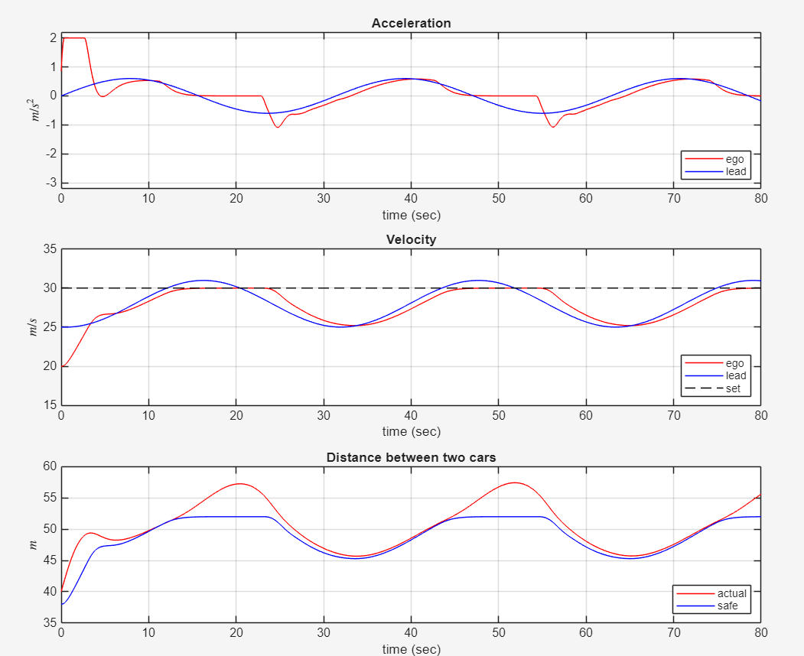

# 🚗 Simulink ADAS: Adaptive Cruise Control (PID & MPC)


A comprehensive MATLAB/Simulink project demonstrating the application of classical and advanced control theory to real-world automotive systems. This repository models both standard Cruise Control and Adaptive Cruise Control (ACC) acting as an Advanced Driver Assistance System (ADAS).

---

## 📖 Project Overview & Results

This project is split into two phases of vehicle dynamics control. Below are the architectural block diagrams and the resulting scope simulations for each phase.

### 1. Standard Cruise Control (PID Controller)
* **Architecture**: Utilizes a classical Proportional-Integral-Derivative (PID) controller within a closed-loop feedback design.
* **Goal**: Maintains the ego vehicle's speed at a driver-set setpoint with minimal overshoot, fast settling time, and negligible steady-state error.
* **Disturbance Handling**: Tested against simulated disturbances, such as an upward slope that temporarily impacts velocity before the PID controller compensates.

#### Simulink Block Diagram


#### Simulation Results
The scope output shows the vehicle reaching the target velocity and responding to dynamic slope disturbances.
* **Result 1:**
  
* **Result 2:**
  

---

### 2. Adaptive Cruise Control (Model Predictive Control - MPC)
* **Architecture**: Extends the foundational model to handle complex, real-world driving scenarios using a Model Predictive Controller (MPC).
* **Goal**: Handles system constraints (e.g., maintaining a safe minimum distance from a lead car). It actively manages acceleration and deceleration based on lead-car maneuvers and spacing errors.
* **Simulation Scenario**: The lead car's acceleration varies dynamically (e.g., following a sine wave). The MPC system computes spacing errors and adjusts the ego car's throttle to ensure collision avoidance while optimizing for the driver-set velocity.

#### Simulink Block Diagram


#### Simulation Results
The scope output highlights the ego car adjusting its speed and maintaining a safe following distance as the lead vehicle accelerates and decelerates over time.
* **ACC Scope Result:**
  

---

## 📂 Repository Contents
* `Cruise_control.slx`: The foundational Simulink model using the PID controller.
* `Cruise_control.slx.r2022a`: A backward-compatible version of the PID model for MATLAB R2022a.
* `mpcACCsystem.slx`: The advanced Simulink model featuring the Model Predictive Controller (MPC) for Adaptive Cruise Control.
* `Result_Images/`: Diagram and scope plot exports.
* `slprj/`: Internal Simulink cache and project dependency files.

## 🚀 Getting Started
1. Clone the repository:
   ```bash
   git clone https://github.com/pranav2007kumar/Simulink-ADAS-CruiseControl.git
   ```
2. Open MATLAB (R2022a or newer recommended).
3. Navigate to the cloned directory.
4. Open `Cruise_control.slx` or `mpcACCsystem.slx`.
5. Run the simulations to view the dynamic vehicle responses in the scopes.

---
*Developed as part of the Modelling, Simulation & Analysis (MSA) Coursework.*
